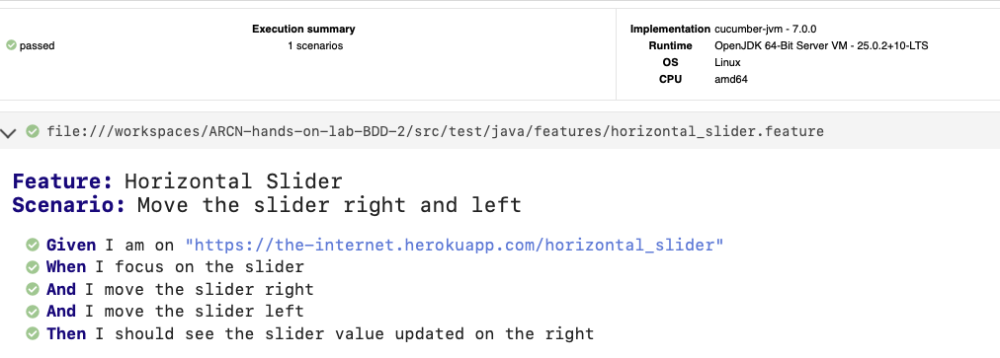

# ARCN Hands-on Lab BDD 2

Laboratorio de BDD en Java con Cucumber, Selenium y Maven.

## Objetivo

Implementar y ejecutar un escenario BDD de interacción con un slider horizontal usando:

- Feature Horizontal Slider.
- Step definitions con Selenium WebDriver.
- Runner de Cucumber con JUnit.

## Estructura del proyecto

```text
ARCN-hands-on-lab-BDD-2/
|- README.md
|- .gitignore
|- pom.xml
|- src/
	|- main/java/com/eci/bdd2/App.java
	|- test/java/
		|- com/eci/bdd2/AppTest.java
		|- features/horizontal_slider.feature
		|- runners/TestRunner.java
		|- steps/HorizontalSliderSteps.java
```

## Tecnologias usadas

- Java
- Maven
- JUnit 4
- Cucumber (`cucumber-java`, `cucumber-junit`)
- Selenium WebDriver
- ChromeDriver en modo headless

## Prerrequisitos

- Java instalado y disponible en `PATH`.
- Maven instalado y disponible en `PATH`.
- Google Chrome y ChromeDriver instalados.
- ChromeDriver accesible en `/usr/local/bin/chromedriver`.

Si ChromeDriver esta en otra ruta, actualizar la propiedad en `src/test/java/steps/HorizontalSliderSteps.java`:

```java
System.setProperty("webdriver.chrome.driver", "/usr/local/bin/chromedriver");
```

## Escenario BDD implementado

Archivo: `src/test/java/features/horizontal_slider.feature`

```gherkin
Feature: Horizontal Slider

  Scenario: Move the slider right and left
    Given I am on "https://the-internet.herokuapp.com/horizontal_slider"
    When I focus on the slider
    And I move the slider right
    And I move the slider left
    Then I should see the slider value updated on the right
```

## Ejecucion

Desde la raiz del repositorio:

```bash
mvn test
```

## Reportes generados

Al ejecutar `mvn test`, Cucumber genera reportes en `target/`:

- `target/JUnitReports/report.xml`
- `target/JSonReports/report.json`
- `target/HtmlReports/report.html`

### Reporte:
[](bdd-java/target/HtmlReports/report.html)

## Autor

Juan Camilo Posso G.
